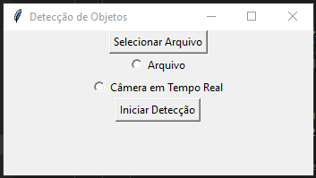
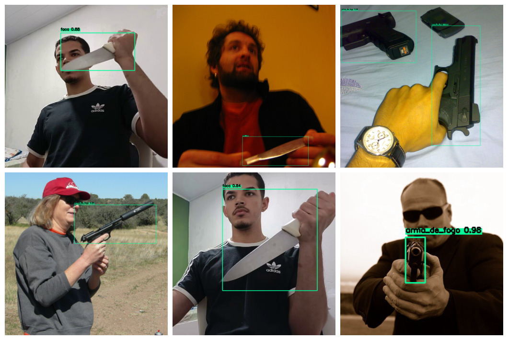

# Yolov4-Deteccao-de-armas
O desenvolvimento deste protótipo trata-se de uma rede YOLOv4 especialmente treinada para detectar armas de fogo e facas, visando aprimorar as medidas de segurança em nossa sociedade. Com a crescente preocupação com a segurança, esse avanço tecnológico se mostra uma ferramenta promissora para auxiliar as forças de segurança a identificar potenciais ameaças de maneira mais eficaz e precisa.

O protótipo foi criado em Python e treinado no ambiente Google Colaboratory com GPU-T4 para maior eficiência computacional. Após a detecção de um objeto suspeito, como uma faca ou arma, o sistema captura uma imagem e envia uma notificação por e-mail com a imagem processada.

# Treinamento
Para treinamento foi utilizado o código disponibilizado no arquivo "treinandomodelo.ipynb" no Google Colaboratory, é importante considerar o uso do ambiente com a GPU-T4 que agiliza o processo de treinamento. Além disso foi utilizado os seguintes parametros de arquivos:
dataset de imagens para o treinamento disponibilizado no seguinte link: [Dataset-Treinamento](https://drive.google.com/file/d/10GEQf4JL1khWJ5Kf3sRLDd7JQInAtNdI/view?usp=sharing).

### Arquivo de configuração
Este arquivo é utilizado para configurar através da alteração de algumas variáveis o número de iterações maximas que serão realizadas pelo modelo, bem como alguns outros parâmetros importantes que devem ser levados em cosideação, para saber mais sobre sugiro que acesse o repositorio do criador da YOLOV4 que contém o passo a passo completo [YOLOV4 Repositório](https://github.com/AlexeyAB/darknet).
Arquivo de configuração do YOLOV4: yolov4-obj.cfg

### Arquivo Data
O arquvivo data é usado para passar o parâmetro de todos os arquivos usados pelo modelo para o treinamento, inclusive o local onde será salvo o arquivo "weights" que é o resultado gerado pelo código após o treinamento.
Arquivo Data: data/obj.data

### Arquivo Names
o arquivo names denota o nomes de cada uma das classes que serão usadas pelo modelo sendo elas faca e arma_de_fogo.
Arquivo Names: data/obj.names

### Arquivos train e test(txt)
Este arquivo é utilizado para passar o caminho completo de todas as imagens que serão usadas em treinamento e teste para o modelo.
Arquivos train e test (txt): data/train.txt e data/test.txt

### Número de Iterações
Treinamos o modelo com 6000 iterações seguindo as recomendações de Alexey Bochkovskiy, criador da YOLO, sendo que, deve-se multiplicar o número de classes que deseja detectar por 2000, entretanto o valor resultante deve ser de pelo menos 6000 caso estiver treinando um modelo menor ou igual a 3 classes, que é justamente o nosso caso, onde consideramos usar duas classes sendo facas e armas de fogo. O valor de 6000 iterações foi uma escolha equilibrada que resultou em um modelo de precisão satisfatória.

# Teste do Modelo

Para teste do modelo é possivel utilizar o arquivo "testandomodelo.py" que abrirá uma janela contendo duas opções de teste, por imagem e video, ou teste por câmera em tempo real (certifique-se de ter uma camera conectada), após a seleção basta clicar no botão de inciar a detecção.

<p align="center">
  
</p>

### Métricas
As métricas são uma ótima forma de comunicar e observar o progresso do modelo, o resultado adquiridos foram baseados no dataset de teste disponibilizado no seguinte link: [Dataset-Teste](https://drive.google.com/file/d/1yTgxhPvmazCo7W4RN6HoF0ord0lEtYDH/view?usp=sharing). 



```diff
+ Para facas, o modelo desenvolvido alcançou uma precisão de 90.18%.
```

```diff
+ Para armas de fogo, a precisão atingiu 83.36%.
```

Recall é a proporção de verdadeiros positivos em relação ao total de objetos verdadeiros na imagem, sendo de 0.86, ou seja a métrica está atrelada a quão apto o modelo está para detectar o máximo de objetos suspeitos em relação aos verdadeiramente existentes, o valor obtido deixa margem para uma tentativa de tentar aprimorar o número máximo de detecções, uma vez que detectar o máximo de objetos suspeitos seja o mais viável para prever delitos criminosos.

F1-score serve para avaliar o equilíbrio entre detecções precisas e detecções completas, alcançando 0.87, sendo uma forma de visualizar a precisão e o recall de uma vez, através de uma média harmônica, com o valor obtido é possível salientar que a média de recall e precisão é de pelo menos 80%, um valor satisfatório, mas com espaço para refinamento.
Essas métricas fornecem uma visão mais detalhada do desempenho do modelo.

Average IoU (Intersection over Union)
O Average IoU foi de 72.39%, essa métrica mede o grau de sobreposição entre as caixas delimitadoras geradas pelo modelo e as caixas delimitadoras reais dos objetos, quanto maior for o valor do Average IoU, melhor será o desempenho do modelo. Portanto, o resultado obtido indica um desempenho consistente, o modelo está fazendo previsões que se sobrepõem bem às verdadeiras localizações dos objetos em média, apesar de ainda existir espaço para refinamentos.

Mean Average Precision (mAP@0.50)
O mAP@0.50 é uma métrica que avalia o desempenho do modelo em diferentes níveis de confiança. O projeto atingiu um mAP@0.50 de 86.77%, significando dizer que 86.77% das predições do modelo atingem uma confiança de pelo menos 50% de certeza quanto ao objeto classificado, o que indica uma alta qualidade nas detecções de objetos suspeitos em diferentes cenários.

```diff
- Considere alterar os caminhos dos arquivos passados por parâmetro dentro do "treinandomodelo.ipynb" e "testandomodelo.py" caso ocorra algum erro.
```
